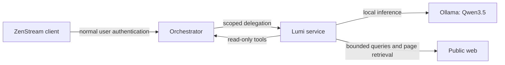

# Lumi

Lumi is ZenStream's local, read-only conversational media assistant. It uses the user's permission-filtered ZenStream catalog and viewing context together with bounded web research, then answers with Markdown, validated ZenStream references, and inspectable sources.

The first implementation targets vanilla Qwen3.5 instruct models. It does not train or fine-tune models. Administrators will expose installed Qwen3.5 models and set runtime limits; each conversation will retain its selected model and thinking preference.

## Service boundary

Lumi runs as a private service behind the Orchestrator. The web and Android clients continue to authenticate with the Orchestrator. The Orchestrator proxies user requests and issues short-lived delegation bound to the authenticated user, live session, conversation, audience, allowed read scopes, expiry, and a unique identifier. Lumi uses that delegation only with a small read-only Orchestrator tool gateway, which separately authenticates the Lumi service, derives user identity from the delegation, checks that the session and conversation remain valid, and reapplies current library grants on every call.

Browser cookies and access/refresh tokens stay at the Orchestrator boundary. Lumi stores conversations by the authenticated account ID and checks ownership for every conversation operation. Browser requests that create or append a conversation also pass the Orchestrator's Origin/CSRF checks. Webpage content is untrusted evidence; only registered, schema-validated read-only tools can execute. Page retrieval validates the destination IP at connection time, rejects private and reserved address ranges, rechecks redirects, sends no Orchestrator credentials, and applies size, redirect, and timeout limits.

## Web research configuration

Web search remains disabled unless the private Lumi service is constructed with a
`WebResearchConfig` containing a trusted SearXNG origin. For example,
service startup can pass `web_research_config=WebResearchConfig(searxng_url="https://search.example.org")`
to `build_zenstream_tool_registry`; leaving it unset keeps local catalog and history tools
available without external requests. The SearXNG deployment must allow `format=json` results.

When enabled, Lumi submits only focused queries derived from the current user message. The
query planner receives no earlier chat turns or local ZenStream results, and the web client
sends queries in a POST body. The configured SearXNG instance may forward each query to its
configured upstream search engines, so deployment documentation should identify that routing
and any applicable logging policy to users. Search results are untrusted evidence; opening a
page requires a short-lived result ID from that conversation and does not forward Orchestrator
credentials.

## Runtime direction

The first runtime adapter targets the local Ollama HTTP API. It provides Qwen3.5 tool calls and per-request thinking control, and can load an installed model on demand and release it after an idle period. The model adapter will normalize runtime responses into Lumi-owned tool-call and tool-result types so agent logic remains independent of Ollama's response format. See the [Qwen3.5 model card](https://huggingface.co/Qwen/Qwen3.5-4B), [Ollama chat API](https://docs.ollama.com/api/chat), and [Ollama API reference](https://github.com/ollama/ollama/blob/main/docs/api.md).

Model artifacts and local benchmark outputs stay outside the production repository. The maintained benchmark harness will record model/runtime identity and measured quality, latency, CPU, and memory results without checking model weights or raw user-library data into Git.

## Development status

The repository began as an empty starter. The service, Orchestrator integration, client experience, tests, and benchmarks are being built in stages. Follow the maintained architecture notes in [`docs/architecture.md`](docs/architecture.md) as the source of service-boundary decisions.
