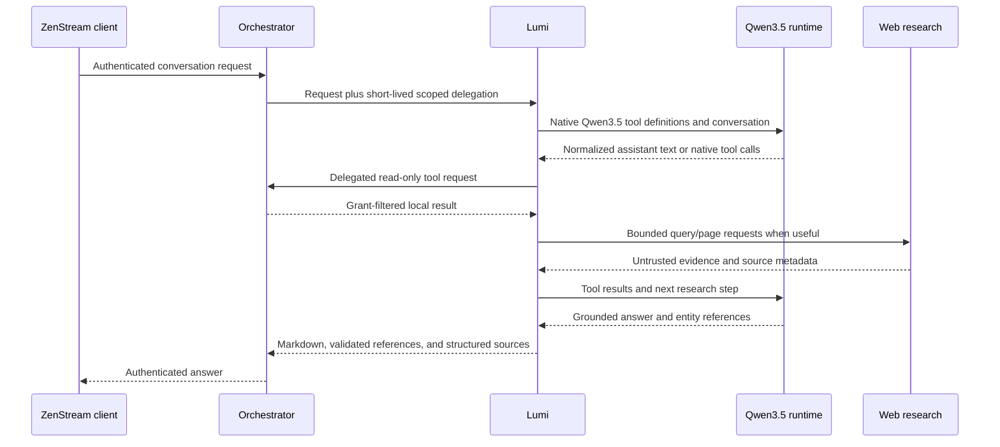

# Lumi architecture

Status: initial implementation decisions, 2026-10-06

## Service responsibilities

### Orchestrator

- Owns public client authentication and account identity.
- Proxies Lumi conversation and model-choice requests after normal account authentication.
- Mints short-lived, audience-scoped delegation bound to the authenticated user, live session, conversation, allowed read scopes, expiry, and a unique identifier. Lumi never receives browser cookies or access/refresh tokens and cannot mint this delegation.
- Exposes a dedicated read-only tool gateway for Lumi. The gateway authenticates the Lumi service separately, derives account identity from the signed delegation, verifies the live session and conversation owner, and reapplies library grants on every call.
- Enforces an expected browser Origin or equivalent CSRF defense on cookie-authenticated requests that create or append conversations.
- Owns ZenStream catalog, watch-history, progress, favourites, and preference reads. A missing read contract should be added as a bounded, grant-filtered route before Lumi depends on it.

### Lumi service

- Owns chat orchestration, persisted conversations, local Qwen3.5 inference, web research, source metadata, and rich-reference validation.
- Scopes every conversation and message operation to the delegated account identity. A client-provided account ID or model-generated identifier never selects the owner.
- Exposes only the read-only ZenStream tools required for answering. It has no playback, download, delete, metadata-edit, watched-state, favourite-write, or library-write tools.
- Keeps conversation model and thinking choices with the conversation. New conversations inherit the configured user/server default.
- Limits tool steps, distinct web searches, fetched pages, repeated queries, context, output, inference time, and simultaneous inference. Tool availability stays bounded and explicit.

### Clients

- Continue to call the Orchestrator for authenticated Lumi APIs.
- Render Markdown and resolve assistant entity references only after the server validates each referenced ID against trusted Orchestrator tool results.
- Render structured web sources separately from the answer text.

## Data flow

Conversation data stays in Lumi's own local store. Lumi does not connect to the Orchestrator database or media filesystem. External search receives only the query needed for research; private history, favourites, usernames, and full library inventories remain local.

## Model and tool protocol

- Support only the Qwen3.5 model family in the first release. Model size remains a configuration value.
- Use the selected runtime's native tool/function calling. Normalize calls into a Lumi-owned representation before validation and dispatch.
- The executor accepts only registered tool names and validates arguments against each tool's schema. Calls for unavailable or state-changing tools are rejected and never mapped to an equivalent write route.
- Treat all retrieved web text as untrusted evidence. It cannot change system policy, tool permissions, model selection, or recommendation scope.
- Restrict page retrieval to HTTP(S), validate and pin the resolved destination at connection time, reject loopback/private/link-local/reserved addresses, and revalidate each redirect. Apply strict redirect, response-size, port, and timeout limits; send no Orchestrator credentials to external sites.
- Never log delegated credentials, full transcripts, raw web pages, or private library snapshots. Keep request payload and per-user rate limits at the Orchestrator boundary.
- Keep the available tool list compact and tool descriptions short; tool-call formatting alone does not ensure a model will choose a tool.
- Recommendations use media available to the delegated user by default. External recommendations require an explicit request. Candidate matching uses provider IDs, aliases, original/localized titles, dates, and type; uncertainty never creates a local reference.
- The answer may contain `:::zenstream{type="..." id="..."}` references only for IDs returned by trusted local tools. The server validates each reference before it reaches a client and returns source metadata as separate structured data.

The initial runtime adapter targets [Ollama's chat API](https://docs.ollama.com/api/chat). Qwen3.5's model card documents native tool use and thinking configuration; thinking is disabled with the model-template setting when selected by the user. Ollama exposes a `think` request option and model residency controls. Keep runtime-specific request fields inside the adapter. See the [Qwen3.5 model card](https://huggingface.co/Qwen/Qwen3.5-4B) and [Ollama API reference](https://github.com/ollama/ollama/blob/main/docs/api.md).

## Runtime lifecycle

- Load models only when a request selects them.
- Keep the number of concurrently resident models and inference requests within admin-configured limits.
- Allow inactive models to unload after a configured idle interval; expose loading, loaded, unloading, unavailable, and error states to administrators.
- Apply configured context and output limits instead of the models' maximum context by default.
- Isolate runtime failures from the Orchestrator process and return a recoverable Lumi error.
- Start with Ollama and preserve a small adapter interface for a later Qwen3.5-capable runtime such as llama.cpp if NAS compatibility or measured CPU performance warrants it.

## Production and evaluation boundary

Production assets include service code, schemas, migrations, prompts, maintained tests, and the benchmark harness. Model weights, raw library snapshots, web-response dumps, exploratory notebooks, and one-off benchmark results remain in user-selected local data locations outside Git.

Before considering fine-tuning, compare available Qwen3.5 0.8B, 2B, and 4B models on the same realistic scenarios. Record conversational and recommendation quality, research and grounding, native tool selection and arguments, unnecessary/missed calls, multi-step completion, entity resolution, multilingual and cross-lingual performance, translation, cold/warm latency, peak RAM, and CPU usage. Report the exact runtime, quantization, context, host, and model revisions so results are reproducible.

## Integration requirements

The Orchestrator API contract, OpenAPI snapshot/fixtures, admin dashboard, deployment/launcher lifecycle, and web client must be updated as part of their respective stages. Keep each stage in its own affected repository worktree and commit completed stages locally. Never expose the Lumi service as an unauthenticated public endpoint.
