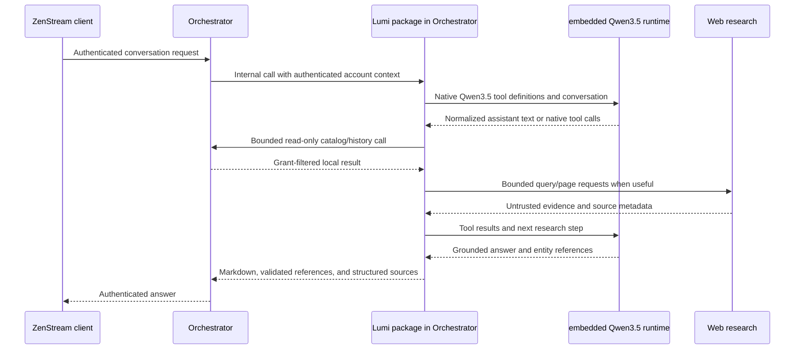

# Lumi architecture

Status: initial implementation decisions, 2026-10-06

## In-process responsibilities

### Orchestrator

- Owns public client authentication and account identity.
- Downloads and installs a supported, versioned Lumi release from its published release into managed runtime storage only after an administrator explicitly enables the integration. An Orchestrator-owned allowlist pins the release version, immutable source revision, runtime API version, optional dependencies, checksum, and compatible Python/platform targets.
- Imports Lumi from that managed release into the Orchestrator process. Lumi remains developed and released from this repository; its source is not copied into the Orchestrator source tree, and there is no separately deployed Lumi service.
- Calls Lumi internally with the current authenticated account context and grants Lumi only bounded, read-only catalog/history adapters.
- Enforces an expected browser Origin or equivalent CSRF defense on cookie-authenticated requests that create or append conversations.
- Owns ZenStream catalog, watch-history, progress, favourites, and preference reads. A missing read contract should be added as a bounded, grant-filtered route before Lumi depends on it.

### Lumi package

- Provides chat orchestration, persisted conversations, embedded Qwen3.5 inference, web research, source metadata, and rich-reference validation as importable Python code.
- Uses only the account context supplied by Orchestrator. A client-provided account ID or model-generated identifier never selects the owner.
- Exposes only the read-only ZenStream tools required for answering. It has no playback, download, delete, metadata-edit, watched-state, favourite-write, or library-write tools.
- Keeps conversation model and thinking choices with the conversation. New conversations inherit the configured user/server default.
- Limits tool steps, distinct web searches, fetched pages, repeated queries, context, output, inference time, and simultaneous inference. Tool availability stays bounded and explicit.

### Clients

- Continue to call the Orchestrator for authenticated Lumi APIs.
- Render Markdown and resolve assistant entity references only after the server validates each referenced ID against trusted Orchestrator tool results.
- Render structured web sources separately from the answer text.

## Data flow

Conversation data and model files stay in Orchestrator-managed storage. The installed Lumi package does not connect directly to the Orchestrator database or media filesystem; it uses the internal read-only adapters. External search receives only the query needed for research; private history, favourites, usernames, and full library inventories remain local.

## Model and tool protocol

- Support only the Qwen3.5 model family in the first release. Model size remains a configuration value.
- Use the selected runtime's native tool/function calling. Normalize calls into a Lumi-owned representation before validation and dispatch.
- The executor accepts only registered tool names and validates arguments against each tool's schema. Calls for unavailable or state-changing tools are rejected and never mapped to an equivalent write route.
- Treat all retrieved web text as untrusted evidence. It cannot change system policy, tool permissions, model selection, or recommendation scope.
- Restrict page retrieval to HTTP(S), validate and pin the resolved destination at connection time, reject loopback/private/link-local/reserved addresses, and revalidate each redirect. Apply strict redirect, response-size, port, and timeout limits; send no Orchestrator credentials to external sites.
- Never log session secrets, full transcripts, raw web pages, or private library snapshots. Keep request payload and per-user rate limits at the Orchestrator boundary.
- Keep the available tool list compact and tool descriptions short; tool-call formatting alone does not ensure a model will choose a tool.
- Recommendations use media available to the current user by default. External recommendations require an explicit request. Candidate matching uses provider IDs, aliases, original/localized titles, dates, and type; uncertainty never creates a local reference.
- The answer may contain `:::zenstream{type="..." id="..."}` references only for IDs returned by trusted local tools. The server validates each reference before it reaches a client and returns source metadata as separate structured data.

The embedded adapter uses the pinned CPU `llama-cpp-python` binding directly in the Orchestrator process. Its compiled wheel is optional and published for supported Python ABIs and host platforms. Qwen3.5's native Jinja chat template handles tool definitions and per-request thinking; Lumi renders the prompt locally and normalizes native tool-call output into runtime-independent contracts. The adapter does not make an inference HTTP request or download models.

Orchestrator verifies the downloaded Lumi release and host-native runtime wheels before atomically making that version importable from managed runtime storage. Its model installer downloads a commit-pinned GGUF only after an administrator requests installation, verifies the exact source revision, size, and SHA-256, writes a manifest, and passes its digest to Lumi. On first model load, Lumi independently verifies the manifest, exact GGUF path, and pinned digest. It caches file identity and change timestamps, rehashing a changed file before load so ordinary idle unload/reload does not rescan unchanged multi-gigabyte weights.

## Runtime lifecycle

- Load models only when a request selects them.
- Load one model lazily and run one generation at a time; switching models unloads the previous model first.
- Allow inactive models to unload after a configured idle interval; expose loading, loaded, unloading, unavailable, and error states to administrators.
- Apply configured context and output limits instead of the models' maximum context by default.
- Run synchronous native generation on a worker thread so the Orchestrator event loop remains responsive. Cancellation stops generation between native token steps; a token step already executing must return before the runtime can release the model. Return recoverable Lumi errors when model loading or inference fails.
- Unload idle models and release model resources when Lumi is disabled or Orchestrator shuts down.

## Production and evaluation boundary

Production assets include service code, schemas, migrations, prompts, maintained tests, and the benchmark harness. Model weights, raw library snapshots, web-response dumps, exploratory notebooks, and one-off benchmark results remain in user-selected local data locations outside Git.

Before considering fine-tuning, compare available Qwen3.5 0.8B, 2B, and 4B models on the same realistic scenarios. Record conversational and recommendation quality, research and grounding, native tool selection and arguments, unnecessary/missed calls, multi-step completion, entity resolution, multilingual and cross-lingual performance, translation, cold/warm latency, peak RAM, and CPU usage. Report the exact runtime, quantization, context, host, and model revisions so results are reproducible.

## Integration requirements

The Orchestrator API contract, OpenAPI snapshot/fixtures, admin dashboard, deployment/launcher lifecycle, and web client must be updated as part of their respective stages. Keep each stage in its own affected repository worktree. The Orchestrator integration must import an explicitly installed compatible Lumi release in-process; it must not vendor Lumi source into the Orchestrator repository or expose a separate public Lumi service.
